# Nanny Maid Django Application

This is a Django-based web application designed to manage nanny and maid services, including user management, subscription plans, service booking, and admin functionalities.

## 📦 Project Structure

- `manage.py` – Django’s command-line utility for administrative tasks.
- `.env` – Environment configuration file (ensure sensitive data like secrets are secured).
- `db.sqlite3` – SQLite database file (for development purposes).
- `new/` – Contains main application code (views, models, templates, etc.).
- `.git/` – Git repository files (do not modify unless required).

## 🚀 Getting Started

### Prerequisites

- Python 3.x
- pip (Python package installer)
- Virtualenv (recommended)

### Installation

1. **Clone or extract the project:**

   ```bash
   git clone <repo-url>
   # or unzip the project
   unzip nanny_maid.zip
   cd nanny_maid
   ```

2. **Create and activate a virtual environment:**

   ```bash
   python -m venv venv
   source venv/bin/activate  # On Windows use `venv\Scripts\activate`
   ```

3. **Install dependencies:**

   ```bash
   pip install -r requirements.txt  # Create this file if missing
   ```

4. **Run migrations:**

   ```bash
   python manage.py migrate
   ```

5. **Run the server:**

   ```bash
   python manage.py runserver
   ```

6. **Access the app:**
   Open your browser and go to: `http://127.0.0.1:8000/`

## 🛠 Features

- User Registration & Authentication
- Service Booking System
- Subscription Plans for Service Providers
- Admin Dashboard
- Payment & Subscription Tracking

## 📁 Environment Variables

Make sure to configure `.env` with necessary variables such as:

```bash
SECRET_KEY=your_secret_key
DEBUG=True
ALLOWED_HOSTS=localhost,127.0.0.1
```

## 📌 Notes

- This project uses SQLite for development. For production, switch to PostgreSQL or MySQL.
- Ensure `.env` and `db.sqlite3` are excluded from version control in production.

## 📄 License

This project is for educational and demonstration purposes. License details can be added here.


## 📸 Output Screenshots

### 🏠 Admin Dashboard
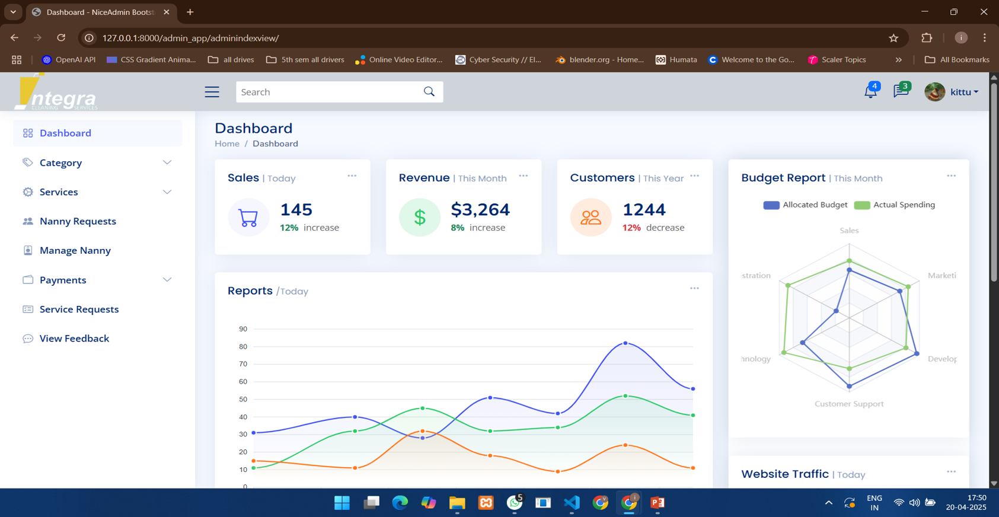

### 🔑 User Login Screen
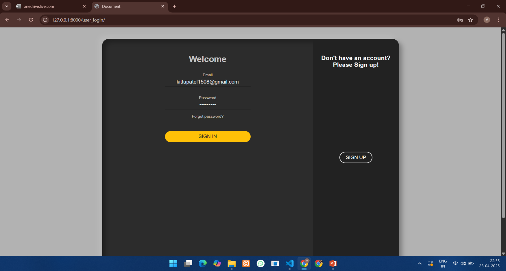

### 📝 Manage Subscription
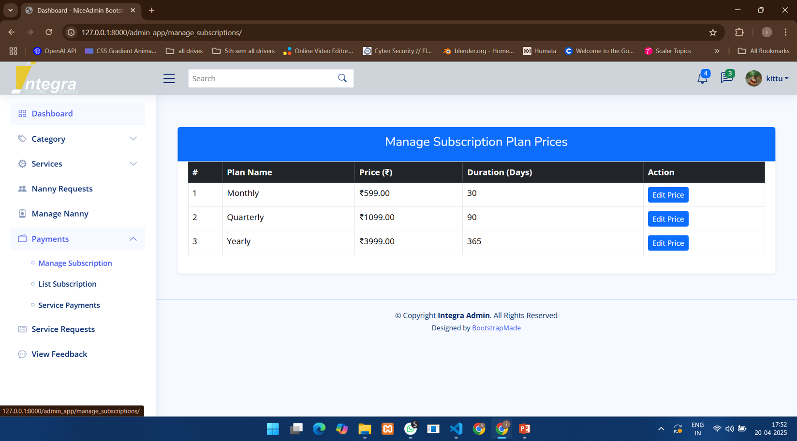

### ➕ Add Category Form
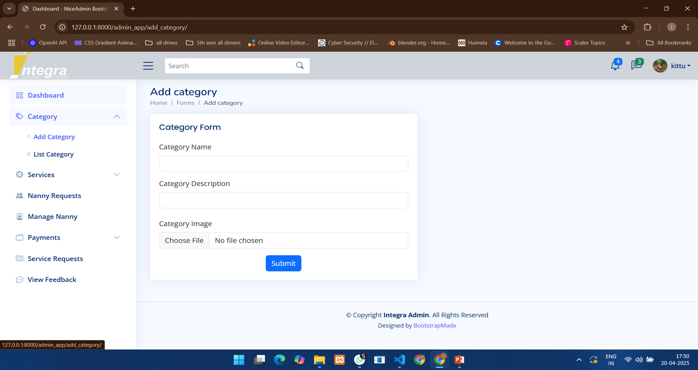

### 📋 Category List
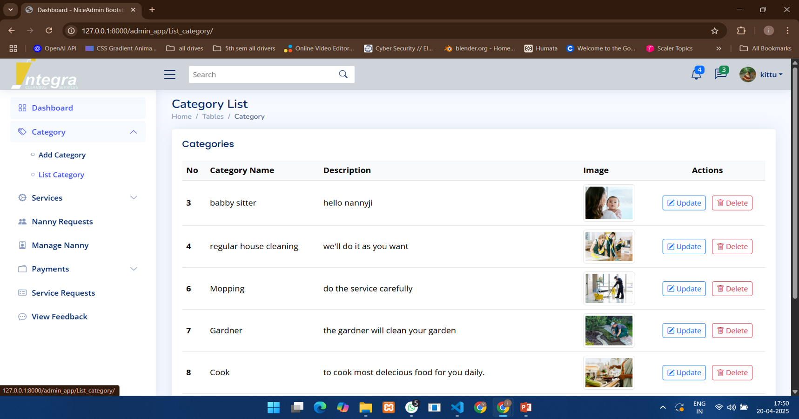

### 👩‍💼 Manage Nanny Users
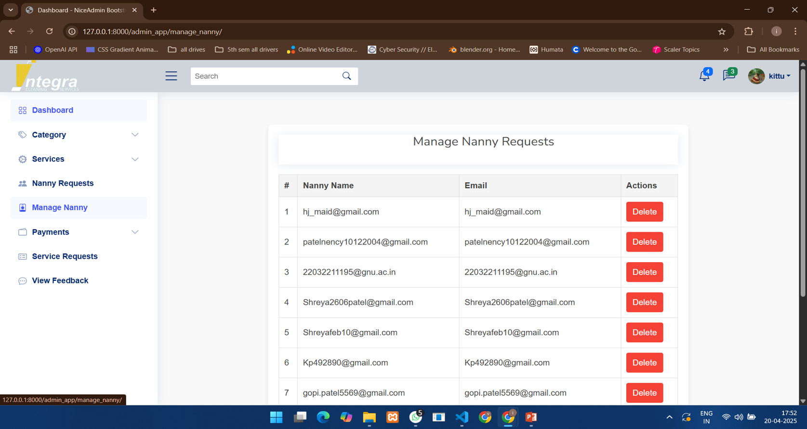

### 📧 Nanny Requests
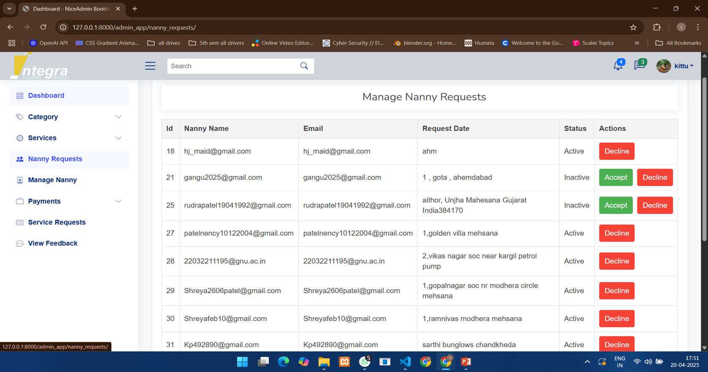

### 🧰 List of Services


### 🛠️ Service Details Output 
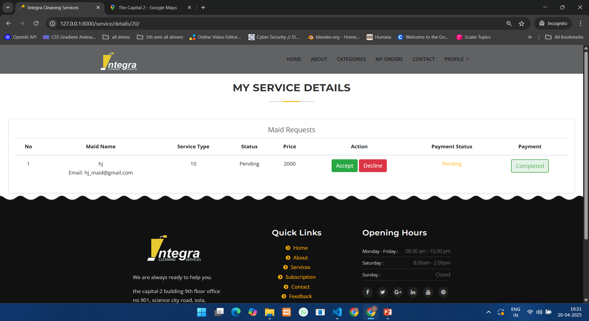

### 📦 Service Request Output  
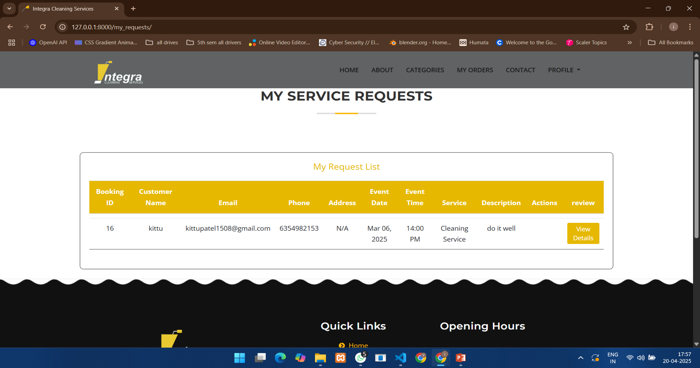

### 🧾 Service Request Form Output 


### 👤 User Output 1  


### 👤 User Output 2  


### 📅 View Bookings Output  
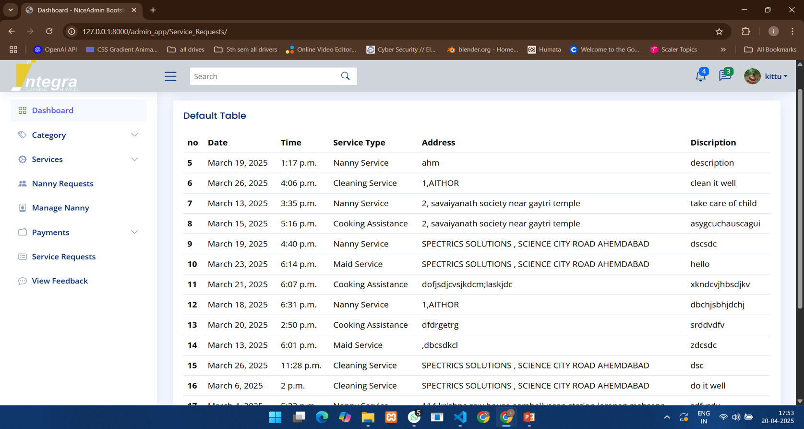

### 🗣️ View Feedback Output  
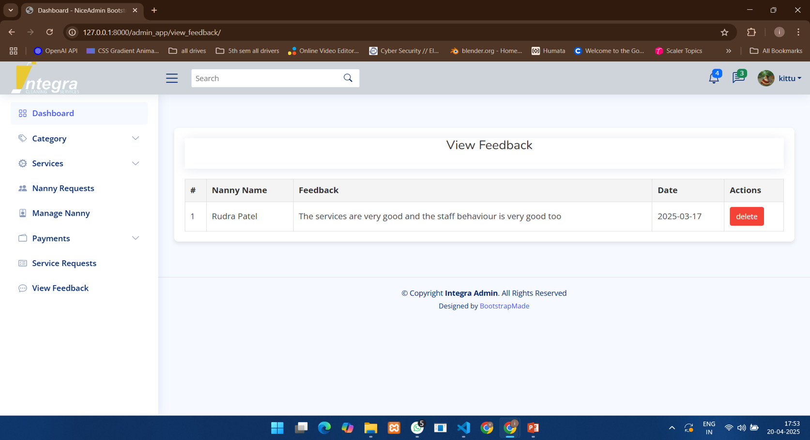

### 💳 View Payment Output  
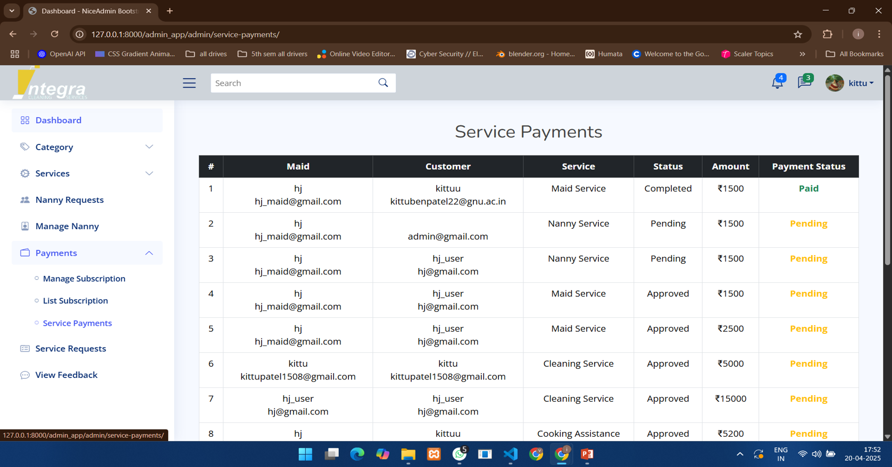
